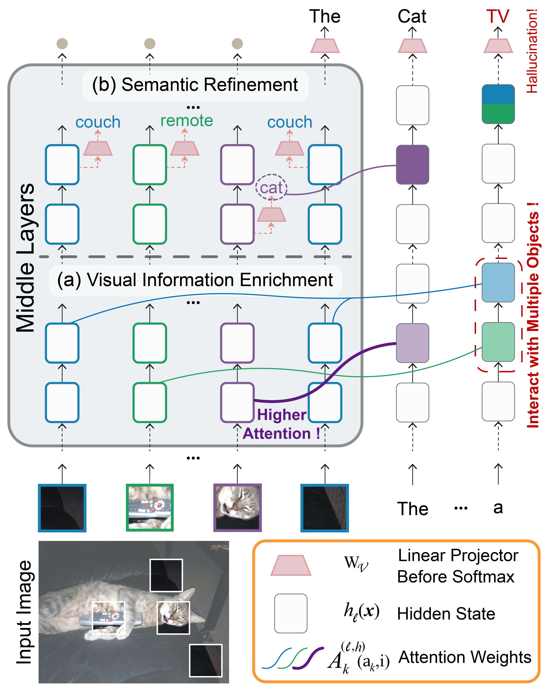

# Devils in Middle Layers of Large Vision-Language Models: Interpreting, Detecting and Mitigating Object Hallucinations via Attention Lens
[](https://arxiv.org/abs/2411.16724)

## Overview

We investigate how LVLMs process visual information and whether this process causes hallucination:

- Firstly, we use the attention lens to identify the stages at which LVLMs handle visual data, discovering that the middle layers are crucial.
Moreover, we find that these layers can be further divided into two stages: "visual information enrichment" and "semantic refinement" which respectively propagate visual data to object tokens and interpret it through text.

- By analyzing attention patterns during the visual information enrichment stage, we find that real tokens consistently receive higher attention weights than hallucinated ones, serving as a strong indicator of hallucination.

- Further examination of multi-head attention maps reveals that hallucination tokens often result from heads interacting with inconsistent objects.

Based on these insights, we propose a simple inference-time method that adjusts visual attention by integrating information across various heads.

## Requirements
We conduct our experiments based on:  
&emsp;Python version: 3.10.14  
&emsp;CUDA toolkit version: 12.1  

Take **LLaVA-1.5-7B** as an example, the model weights can be downloaded from [liuhaotian/llava-v1.5-7b](https://huggingface.co/liuhaotian/llava-v1.5-7b).

To install the package in an existing environment, run
``` bash
pip install -r requirements.txt
```

Our experiments is based on _MSCOCO 2014 Validation set_. Please download [here](https://cocodataset.org/#download).

## Content
- `middle_layers_indicating_hallucination.ipynb`: our main findings.
- `modify_attention.py`: implementation of _Heads Guided Attention Intervention_ method.
- `model_manager.py`: used to load model, prepare inputs and decode output.
- `chair.py`: contains the CHAIR evaluator for sampling real and hallucinated object tokens.
- `extract_VAR.py`: used to extract visual attention ratio (VAR) features for detection.
- `train.py`: train the two-layer MLP classifier with extracted VAR features.

## Usage
### 🔍 Hallucination Detection with VAR Features
#### 1️⃣ Extract VAR features
To extract the VAR features for real and hallucinated object tokens, run
```bash
python extract_VAR.py --instruction-path examples/toy_img_query_list.jsonl --output-file llava_7b_var_features.pt
```
where the object token type is annotated by COCO gt labels. The features will be saved in `var_data/`.

#### 2️⃣ Train Detector
To train the classifier with VAR features in a layer range, run
```bash
python train.py --data-path ./var_data/llava_7b_var_features.pt --model llava-1.5 --start-layer 5 --end-layer 18
```
and the hyper-parameters (e.g., lr, hidden size) for training the classifier can be changed in `train.py`.


### 🧑‍🏫 _Heads Guided Attention Intervention_ During inference
To use our attention intervention method, please insert the following code before model inference:
```python
llama_head_guide(
    model=model_manager.llm_model,
    guided_layer_range=guided_layer_range,
    aggregation='mean',
    alpha=alpha,
    img_start_idx=model_manager.img_start_idx,
    img_end_idx=model_manager.img_end_idx
)
```
where the parameter `guided_layer_range` represents the range of the visual information enrichment stage, e.g., 5-18 layers for LLaVA-1.5-7B.

#### Evaluation
First, generate the LVLM's descriptions and save them in `log/[model]/[file_name].jsonl`:
```bash
# Greedy heads guided decoding
python chair_eval.py --model llava-1.5 --use-head-guide --guide-range 5,18
```
Then, evaluate CHAIR metrics, run
```bash
python chair.py --cap_file ./log/[model]/[file_name].jsonl
```

## Citation
Please cite our paper if it's helpful to your work!
```
@article{jiang2024devils,
  title={Devils in Middle Layers of Large Vision-Language Models: Interpreting, Detecting and Mitigating Object Hallucinations via Attention Lens},
  author={Jiang, Zhangqi and Chen, Junkai and Zhu, Beier and Luo, Tingjin and Shen, Yankun and Yang, Xu},
  journal={arXiv preprint arXiv:2411.16724},
  year={2024}
}
```

## Acknowledgments
This repository borrows heavily from [PAI](https://github.com/LALBJ/PAI) and [VLM-Visualizer](https://github.com/zjysteven/VLM-Visualizer). We thank them for their impressive work and contributions to open source!
